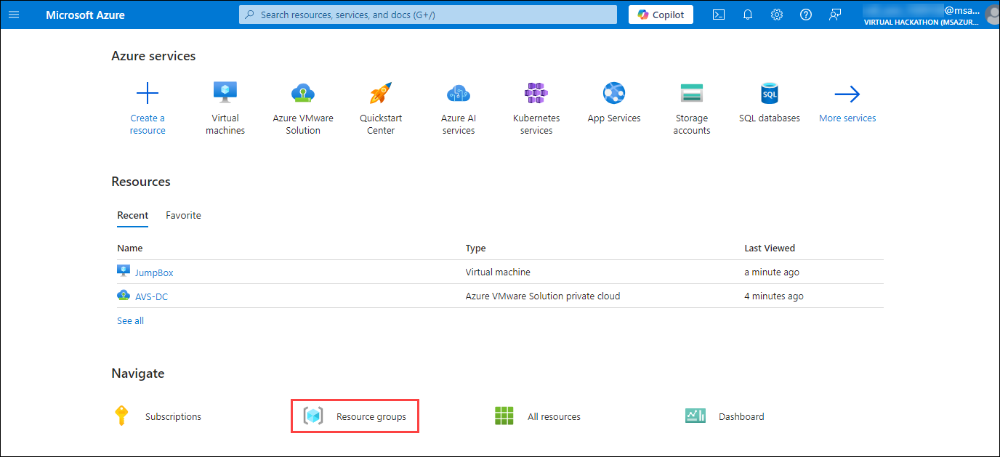
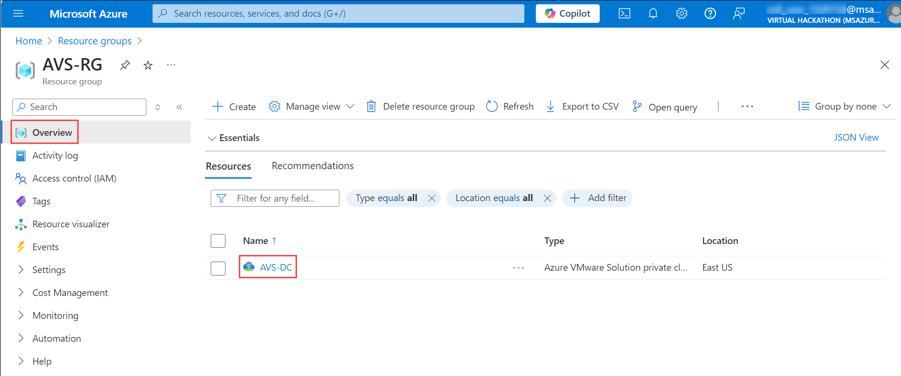
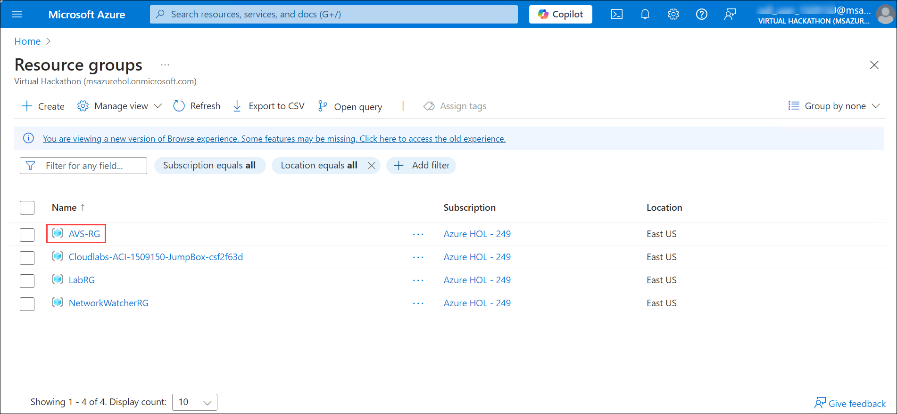
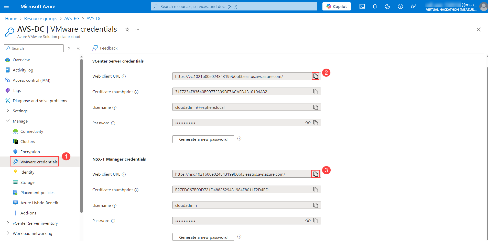
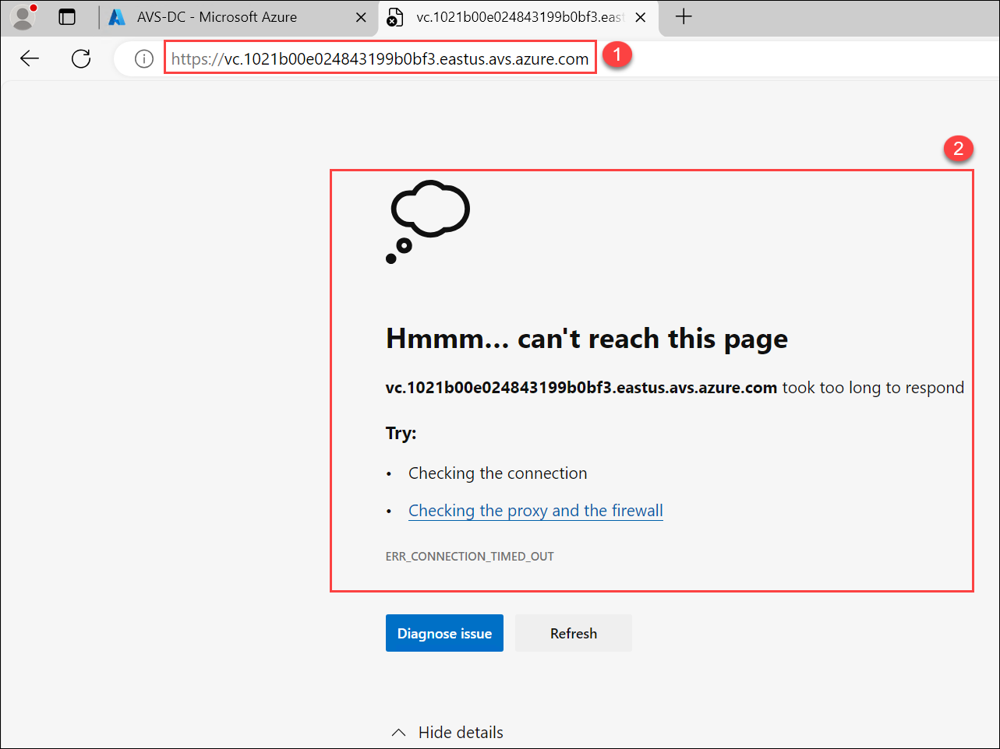
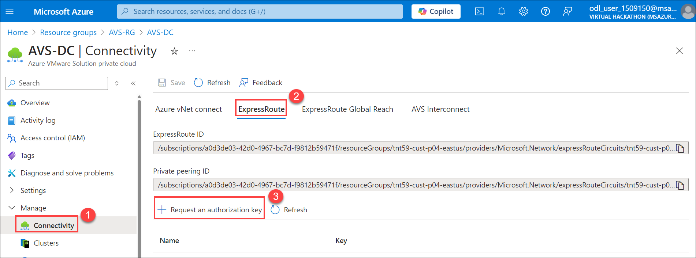

# Exercise 1: Understand the AVS deployment architecture

Azure VMware Solution offers a private cloud environment accessible from On-Premises and Azure-based resources. Services such as Azure ExpressRoute, VPN connections, or Azure Virtual WAN deliver the connectivity.

## Scenario

A large healthcare organization is struggling to securely connect and integrate its on-premises VMware workloads with new cloud-based applications in Azure, while maintaining internet access for essential tasks.

## Architecture diagram:

## Lab objectives

In this exercise, you will complete the following tasks:

+ Task 1: Review the existing resources on the Azure portal 
+ Task 2: AVS Connectivity Options

### Task 1: Review the existing resources on the Azure portal

In this task, you will review the Pre-created resources on your Azure Portal.

1. In your web browser open `https://portal.azure.com/` and navigate to the **Azure portal** and sign in with your user credentials if you are not already signed in.
    * **Sign In Email/Username:** <inject key="AzureAdUserEmail"></inject>
    * **Sign In Password:** <inject key="AzureAdUserPassword"></inject>
3. On Azure portal, click on the **Resource groups** from the **Navigate** section.

    
    
4. From the **Resource group** page, notice the resource groups **AVS-RG** and **LabRG-<inject key="DeploymentID" />**.

    

5. Click on **AVS-RG** to view the resources present in it, you should see a resource of the **AVS Private Cloud** type named **AVS-DC**.

    

6. You will be utilizing **LabRG-<inject key="DeploymentID" />** for depolying and connecting to JumpBox **Virtual Machine**. 

    

### Task 2: AVS Connectivity Options

In this section, you will create a connection between an existing, non-AVS Virtual Network in Azure and the Azure VMware Solution environment. This allows the JumpBox virtual machine you created to manage key components in the VMware management plane such as vCenter, HCX, and NSX-T. You will also be able to access Virtual Machines deployed in AVS and allow those VMs to access resources deployed in the Hub or Spoke VNet’s, such as Private Endpoints and other Azure VMs or Services.

**Summary**: Generate a new Authorization Key in the AVS ExpressRoute settings, and then create a new Connection from the Virtual Network Gateway in the VNet where the JumpBox is connected.

### Option 1: Internal ExpressRoute Setup from AVS -> VNet

 > **NOTE**: Since we already have a virtual network gateway, you’ll add a connection between it and your Azure VMware Solution private cloud.

1. On your virtual machine, click on the Azure Portal icon, as shown below:
 
    
 
2. You'll see the **Sign into Microsoft Azure** tab. Here, enter your credentials:
 
   - **Email/Username:** <inject key="AzureAdUserEmail"></inject>
 
    
 
3. Next, provide your password:
 
   - **Password:** <inject key="AzureAdUserPassword"></inject>
 
   
 
4. If prompted to stay signed in, you can click "No."

5. If you are prompted with a window for MFA, click on **Ask Later**.

6. If a **Welcome to Microsoft Azure** pop-up window appears, simply click "Maybe Later" to skip the tour.

7. On Azure portal, click on the **Resource groups** from the **Navigate** section. 

   
   
8. From the **Resource group** page, open **AVS-RG** by clicking on it.
  
   
   
9. Now, you can see the resources in **AVS-RG**, select **AVS-DC** resource of **AVS Private cloud** type.

   
   
10. From **AVS-DC** blade, click on **VMware credentials** (1), then copy **Web client URL of vCenter Server**.

    
   
11. Now, open the new tab in **Edge** browser in **JumpBox** and paste the **Web client URL of vCenter Server**. You will see it is not available because there is no connectivity with AVS-DC VMware private cloud yet. In the next step you will start configuring the connectivity on **AVS-DC** with **JumpBOX-vNet** using Azure Virtual Gateway.

    
   
12. From **AVS-DC** blade, click on **Connectivity** option under **Manage** section and then select **ExpressRoute** from the available connectivity options. In the last, click on **+ Request an authorization key**.

    
   
13. Give your authorization key a name: `az-vnet-key`. Click **Create**. It may take about 30 seconds to create the key. Save the key in notepad to use in next exercise.

    
    
## Review
In this exercise, you have completed:
- Reviewed the existing resources on the Azure portal 

## References:
[Tutorial - create azure virtual machine | Microsoft Docs](https://learn.microsoft.com/en-us/azure/virtual-machines/windows/quick-create-portal)

